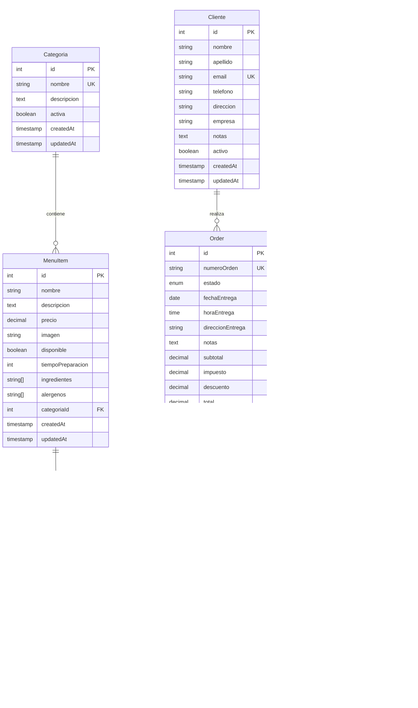
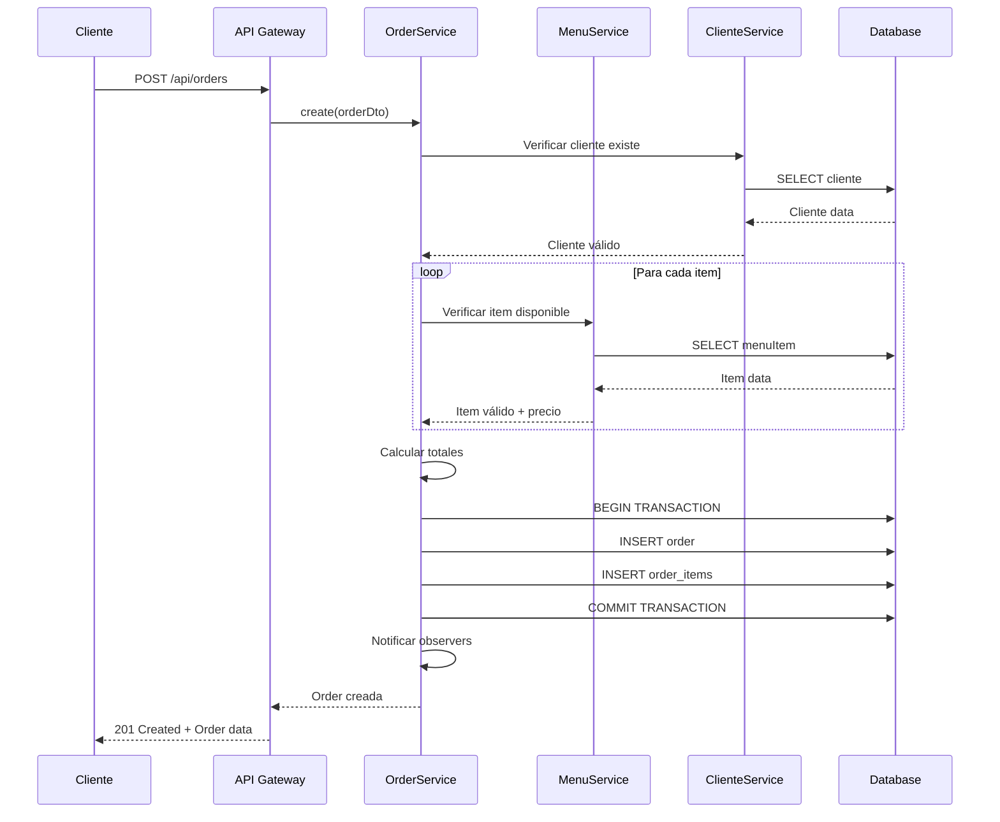
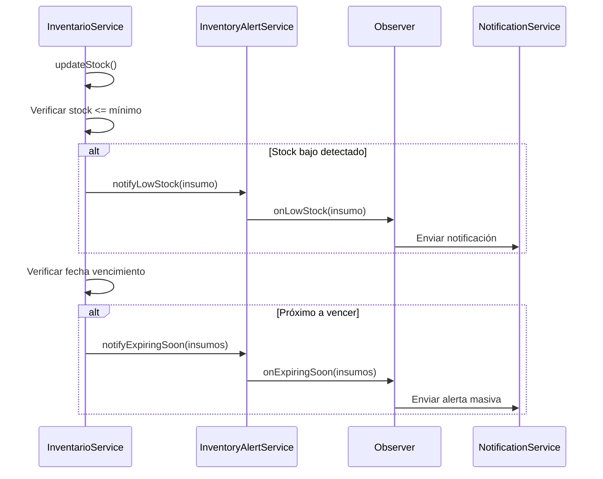

# 📖 Manual Técnico - Sistema de Gestión de Catering

## 🎯 Índice
1. [Visión General](#visión-general)
2. [Arquitectura del Sistema](#arquitectura-del-sistema)
3. [Patrones de Diseño Implementados](#patrones-de-diseño-implementados)
4. [Diseño de Base de Datos](#diseño-de-base-de-datos)
5. [Estructura del Proyecto](#estructura-del-proyecto)
6. [Componentes Principales](#componentes-principales)
7. [Flujos de Trabajo](#flujos-de-trabajo)
8. [APIs y Endpoints](#apis-y-endpoints)
9. [Configuración y Deployment](#configuración-y-deployment)
10. [Consideraciones de Rendimiento](#consideraciones-de-rendimiento)

---

## 🎯 Visión General

### Objetivo del Sistema
El Sistema de Gestión de Catering es una aplicación backend desarrollada con **NestJS** y **TypeScript** que proporciona una API REST completa para la gestión integral de un negocio de catering, incluyendo clientes, menús, pedidos, inventario y entregas.

### Tecnologías Principales
- **Framework**: NestJS 11.x
- **Lenguaje**: TypeScript 5.x
- **Base de Datos**: PostgreSQL 12+
- **ORM**: TypeORM 0.3.x
- **Documentación**: Swagger/OpenAPI 3.0
- **Validación**: Class Validator
- **Testing**: Jest

### Requisitos del Sistema
- Node.js 18+ 
- PostgreSQL 12+
- NPM 8+
- 2GB RAM mínimo
- 1GB espacio en disco

---

## 🏗️ Arquitectura del Sistema

### Arquitectura General
El sistema sigue el patrón **MVC (Model-View-Controller)** adaptado para APIs REST:

```
┌─────────────────┐    ┌─────────────────┐    ┌─────────────────┐
│   Controller    │    │    Service      │    │    Repository   │
│   (HTTP Layer)  │───▶│  (Business      │───▶│   (Data Access) │
│                 │    │   Logic)        │    │                 │
└─────────────────┘    └─────────────────┘    └─────────────────┘
         │                       │                       │
         ▼                       ▼                       ▼
┌─────────────────┐    ┌─────────────────┐    ┌─────────────────┐
│   DTOs/Swagger  │    │   Patterns      │    │   TypeORM       │
│   Validation    │    │   Implementation│    │   Entities      │
└─────────────────┘    └─────────────────┘    └─────────────────┘
```

### Capas de la Aplicación

#### 1. **Capa de Presentación (Controllers)**
- Maneja peticiones HTTP
- Validación de entrada
- Serialización de respuestas
- Documentación automática con Swagger

#### 2. **Capa de Lógica de Negocio (Services)**
- Implementación de reglas de negocio
- Coordinación entre diferentes dominios
- Implementación de patrones de diseño
- Manejo de transacciones

#### 3. **Capa de Acceso a Datos (Repositories)**
- Abstracción del acceso a datos
- Consultas específicas de dominio
- Manejo de relaciones entre entidades

#### 4. **Capa de Persistencia (Entities)**
- Definición de modelos de datos
- Mapeo objeto-relacional
- Configuración de relaciones

---

## 🎨 Patrones de Diseño Implementados

### Patrones Creacionales

#### 1. **Factory Pattern**
**Ubicación**: `src/modules/orders/factories/order-number.factory.ts`

```typescript
@Injectable()
export class OrderNumberFactory {
  generateOrderNumber(): string {
    // Genera números únicos con formato: ORD-YYYY-MM-DD-HHMMSS-XXX
  }
}
```

**Propósito**: Centralizar la creación de números de orden únicos con formato estándar.

#### 2. **Module Pattern**
**Ubicación**: Todos los archivos `*.module.ts`

```typescript
@Module({
  imports: [TypeOrmModule.forFeature([Entity])],
  controllers: [Controller],
  providers: [Service],
  exports: [Service],
})
export class FeatureModule {}
```

**Propósito**: Organizar la aplicación en módulos cohesivos y reutilizables.

### Patrones Estructurales

#### 3. **Repository Pattern**
**Ubicación**: Todos los servicios (`*.service.ts`)

```typescript
@Injectable()
export class ClientesService {
  constructor(
    @InjectRepository(Cliente)
    private readonly clienteRepository: Repository<Cliente>,
  ) {}
}
```

**Propósito**: Encapsular la lógica de acceso a datos y abstraer la persistencia.

#### 4. **DTO Pattern (Data Transfer Object)**
**Ubicación**: Carpetas `dto/` en cada módulo

```typescript
export class CreateClienteDto {
  @IsString()
  @MaxLength(100)
  nombre: string;
  // ...
}
```

**Propósito**: Transferir datos entre capas con validación y tipado fuerte.

### Patrones de Comportamiento

#### 5. **Observer Pattern**
**Ubicación**: 
- `src/modules/orders/orders.service.ts`
- `src/modules/inventario/services/inventory-alert.service.ts`

```typescript
export interface OrderObserver {
  onOrderStatusChanged(order: Order, oldStatus: OrderStatus, newStatus: OrderStatus): void;
}

@Injectable()
export class OrdersService {
  private observers: OrderObserver[] = [];
  
  addObserver(observer: OrderObserver): void {
    this.observers.push(observer);
  }
  
  private notifyObservers(order: Order, oldStatus: OrderStatus, newStatus: OrderStatus): void {
    this.observers.forEach(observer => {
      observer.onOrderStatusChanged(order, oldStatus, newStatus);
    });
  }
}
```

**Propósito**: Notificar cambios de estado en pedidos y alertas de inventario.

#### 6. **Strategy Pattern**
**Ubicación**: `src/modules/menu/menu.service.ts` - Método `buscarMenuItems`

```typescript
async buscarMenuItems(criterios: {
  nombre?: string;
  categoriaId?: number;
  precioMin?: number;
  precioMax?: number;
  ingredientes?: string[];
  sinAlergenos?: string[];
}) {
  const queryBuilder = this.menuItemRepository.createQueryBuilder('menuItem');
  
  // Strategy: Búsqueda por nombre
  if (criterios.nombre) {
    queryBuilder.andWhere('menuItem.nombre ILIKE :nombre', { nombre: `%${criterios.nombre}%` });
  }
  
  // Strategy: Filtro por categoría
  if (criterios.categoriaId) {
    queryBuilder.andWhere('menuItem.categoriaId = :categoriaId', { categoriaId: criterios.categoriaId });
  }
  
  // ... más estrategias
}
```

**Propósito**: Implementar diferentes algoritmos de búsqueda según los criterios.

---

## 🗄️ Diseño de Base de Datos

### Modelo Entidad-Relación



### Consideraciones de Diseño

#### Normalización
- **3FN (Tercera Forma Normal)**: Eliminación de dependencias transitivas
- **Claves Primarias**: Todas las tablas tienen ID autoincremental
- **Claves Foráneas**: Integridad referencial garantizada
- **Índices**: En campos de búsqueda frecuente (email, numeroOrden)

#### Tipos de Datos
- **IDs**: `INTEGER` con autoincremento
- **Strings**: `VARCHAR` con límites apropiados
- **Decimales**: `DECIMAL(10,2)` para precios y cantidades
- **Fechas**: `DATE`, `TIME`, `TIMESTAMP` según contexto
- **Enums**: Para estados controlados
- **Arrays**: `simple-array` para listas simples

#### Soft Delete
Implementado en entidades principales mediante campo `activo`/`disponible` para mantener integridad histórica.

---

## 📁 Estructura del Proyecto

```
src/
├── entities/                    # Entidades de TypeORM
│   ├── cliente.entity.ts       # Modelo Cliente
│   ├── categoria.entity.ts     # Modelo Categoría  
│   ├── menu-item.entity.ts     # Modelo MenuItem
│   ├── order.entity.ts         # Modelo Order
│   ├── order-item.entity.ts    # Modelo OrderItem
│   ├── insumo.entity.ts        # Modelo Insumo
│   ├── delivery.entity.ts      # Modelo Delivery
│   └── index.ts                # Exportaciones
│
├── modules/                     # Módulos de negocio
│   ├── clientes/               # Gestión de clientes
│   │   ├── dto/                # DTOs para clientes
│   │   ├── clientes.controller.ts
│   │   ├── clientes.service.ts
│   │   └── clientes.module.ts
│   │
│   ├── menu/                   # Gestión de menús
│   │   ├── dto/                # DTOs para menús
│   │   ├── menu.controller.ts
│   │   ├── menu.service.ts
│   │   └── menu.module.ts
│   │
│   ├── orders/                 # Gestión de pedidos
│   │   ├── dto/                # DTOs para pedidos
│   │   ├── factories/          # Factory para números de orden
│   │   ├── orders.controller.ts
│   │   ├── orders.service.ts
│   │   └── orders.module.ts
│   │
│   └── inventario/             # Gestión de inventario
│       ├── dto/                # DTOs para inventario
│       ├── services/           # Servicios auxiliares
│       ├── inventario.controller.ts
│       ├── inventario.service.ts
│       └── inventario.module.ts
│
├── config/                     # Configuraciones
│   ├── database.config.ts      # Configuración de BD
│   └── jwt.config.ts          # Configuración JWT
│
├── app.module.ts              # Módulo raíz
└── main.ts                    # Punto de entrada
```

### Convenciones de Nomenclatura

#### Archivos
- **Entidades**: `nombre.entity.ts`
- **Servicios**: `nombre.service.ts`
- **Controladores**: `nombre.controller.ts`
- **Módulos**: `nombre.module.ts`
- **DTOs**: `accion-nombre.dto.ts`

#### Clases
- **PascalCase**: `ClientesService`, `CreateClienteDto`
- **Interfaces**: `I` prefijo - `IClienteRepository`
- **Enums**: `EstadoPedido`, `TipoUsuario`

#### Variables y Métodos
- **camelCase**: `clienteRepository`, `findAllClientes`
- **Constantes**: `UPPER_SNAKE_CASE`

---

## 🔧 Componentes Principales

### 1. Gestión de Clientes

#### Responsabilidades
- CRUD completo de clientes
- Historial de pedidos por cliente
- Búsqueda avanzada
- Identificación de clientes recurrentes

#### Características Técnicas
- Validación de email único
- Soft delete con campo `activo`
- Paginación en listados
- Relaciones lazy con pedidos

### 2. Catálogo de Menús

#### Responsabilidades
- Gestión de categorías de menú
- CRUD de items del menú
- Búsqueda por múltiples filtros
- Gestión de ingredientes y alérgenos

#### Características Técnicas
- Strategy Pattern para búsquedas
- Relaciones bidireccionales categoría-items
- Validación de precios positivos
- Arrays para ingredientes y alérgenos

### 3. Gestión de Pedidos

#### Responsabilidades
- Creación de pedidos con validación
- Estados del pedido con transiciones
- Cálculo automático de totales
- Generación de números de orden únicos

#### Características Técnicas
- Factory Pattern para números de orden
- Observer Pattern para notificaciones
- Transacciones para consistencia
- Validación de items disponibles

### 4. Inventario de Insumos

#### Responsabilidades
- CRUD de insumos
- Alertas de stock bajo
- Control de fechas de vencimiento
- Reportes de inventario

#### Características Técnicas
- Observer Pattern para alertas
- Validaciones de cantidades positivas
- Búsqueda por múltiples criterios
- Cálculo de valor total de inventario

---

## 🔄 Flujos de Trabajo

### Flujo de Creación de Pedido



### Flujo de Alerta de Inventario



---

## 🌐 APIs y Endpoints

### Estructura de Response Estándar

```typescript
// Respuesta exitosa
{
  "data": T,
  "message": "string",
  "statusCode": number
}

// Respuesta con paginación
{
  "data": T[],
  "total": number,
  "page": number,
  "limit": number,
  "totalPages": number
}

// Respuesta de error
{
  "statusCode": number,
  "message": string | string[],
  "error": "string"
}
```

### Códigos de Estado HTTP

| Código | Uso | Descripción |
|--------|-----|-------------|
| 200 | GET, PATCH | Operación exitosa |
| 201 | POST | Recurso creado |
| 204 | DELETE | Eliminación exitosa |
| 400 | Validación | Datos inválidos |
| 404 | No encontrado | Recurso no existe |
| 409 | Conflicto | Violación de unicidad |
| 500 | Error interno | Error del servidor |

### Ejemplos de Endpoints

#### Clientes
```http
GET /api/clientes?page=1&limit=10
POST /api/clientes
GET /api/clientes/1
PATCH /api/clientes/1
DELETE /api/clientes/1
GET /api/clientes/1/historial-pedidos
GET /api/clientes/buscar?nombre=juan&email=@gmail.com
```

#### Menú
```http
GET /api/menu/categorias
POST /api/menu/categorias
GET /api/menu/items?categoriaId=1&page=1
POST /api/menu/items
GET /api/menu/catalogo
GET /api/menu/items/buscar?nombre=pizza&precioMax=25
```

#### Pedidos
```http
GET /api/orders?estado=pendiente&fechaDesde=2025-01-01
POST /api/orders
GET /api/orders/1
PATCH /api/orders/1/status
PATCH /api/orders/1/cancel
GET /api/orders/estadisticas?fechaDesde=2025-01-01
```

#### Inventario
```http
GET /api/inventario?page=1&limit=10
POST /api/inventario
GET /api/inventario/stock-bajo
GET /api/inventario/proximos-vencer?dias=7
PATCH /api/inventario/1/stock
GET /api/inventario/estadisticas
```

---

## ⚙️ Configuración y Deployment

### Variables de Entorno

#### Desarrollo
```env
NODE_ENV=development
PORT=3000
DB_HOST=localhost
DB_PORT=5432
DB_USERNAME=postgres
DB_PASSWORD=password
DB_NAME=catering_db
JWT_SECRET=dev-secret-key
JWT_EXPIRES_IN=7d
```

#### Producción
```env
NODE_ENV=production
PORT=3000
DB_HOST=prod-host
DB_PORT=5432
DB_USERNAME=prod_user
DB_PASSWORD=secure_password
DB_NAME=catering_prod
DB_SSL=true
JWT_SECRET=ultra-secure-production-key
JWT_EXPIRES_IN=24h
```

### Configuración de Base de Datos

#### Desarrollo
- Sincronización automática de esquemas (`synchronize: true`)
- Logging de consultas habilitado
- SSL deshabilitado

#### Producción
- Sincronización deshabilitada (`synchronize: false`)
- Migraciones manuales
- SSL requerido
- Pool de conexiones optimizado

### Deployment con Docker

```dockerfile
# Dockerfile
FROM node:18-alpine AS builder
WORKDIR /app
COPY package*.json ./
RUN npm ci --only=production && npm cache clean --force
COPY . .
RUN npm run build

FROM node:18-alpine AS production
WORKDIR /app
COPY --from=builder /app/node_modules ./node_modules
COPY --from=builder /app/dist ./dist
COPY --from=builder /app/package.json ./package.json
EXPOSE 3000
CMD ["npm", "run", "start:prod"]
```

```yaml
# docker-compose.yml
version: '3.8'
services:
  app:
    build: .
    ports:
      - "3000:3000"
    environment:
      - NODE_ENV=production
      - DB_HOST=postgres
    depends_on:
      - postgres
    
  postgres:
    image: postgres:14-alpine
    environment:
      POSTGRES_DB: catering_db
      POSTGRES_USER: postgres
      POSTGRES_PASSWORD: password
    volumes:
      - postgres_data:/var/lib/postgresql/data
    ports:
      - "5432:5432"

volumes:
  postgres_data:
```

---

## 🚀 Consideraciones de Rendimiento

### Optimizaciones de Base de Datos

#### Índices Recomendados
```sql
-- Índices para búsquedas frecuentes
CREATE INDEX idx_cliente_email ON clientes(email);
CREATE INDEX idx_order_numero ON orders(numeroOrden);
CREATE INDEX idx_order_cliente_fecha ON orders(clienteId, fechaEntrega);
CREATE INDEX idx_menuitem_categoria ON menu_items(categoriaId);
CREATE INDEX idx_menuitem_precio ON menu_items(precio);
CREATE INDEX idx_insumo_stock ON insumos(cantidadActual, cantidadMinima);
```

#### Query Optimization
- Uso de `QueryBuilder` para consultas complejas
- Eager loading selectivo con `relations`
- Paginación obligatoria en listados
- Proyección de campos específicos cuando es posible

### Caching Strategy

#### Nivel de Aplicación
```typescript
// Cache de categorías (raramente cambian)
@Injectable()
export class MenuService {
  private categoriasCache: Categoria[] | null = null;
  private cacheExpiry: number = 0;
  
  async getCategorias(): Promise<Categoria[]> {
    const now = Date.now();
    if (this.categoriasCache && now < this.cacheExpiry) {
      return this.categoriasCache;
    }
    
    this.categoriasCache = await this.categoriaRepository.find();
    this.cacheExpiry = now + (15 * 60 * 1000); // 15 minutos
    return this.categoriasCache;
  }
}
```

#### Nivel de Base de Datos
- Query result caching en PostgreSQL
- Connection pooling optimizado
- Prepared statements automáticos

### Monitoring y Métricas

#### Logging Estructurado
```typescript
import { Logger } from '@nestjs/common';

@Injectable()
export class OrdersService {
  private readonly logger = new Logger(OrdersService.name);
  
  async create(orderDto: CreateOrderDto): Promise<Order> {
    const startTime = Date.now();
    
    try {
      const result = await this.processOrder(orderDto);
      const duration = Date.now() - startTime;
      
      this.logger.log(`Order created successfully`, {
        orderId: result.id,
        clienteId: orderDto.clienteId,
        duration,
        itemsCount: orderDto.items.length
      });
      
      return result;
    } catch (error) {
      this.logger.error(`Failed to create order`, {
        clienteId: orderDto.clienteId,
        error: error.message,
        duration: Date.now() - startTime
      });
      throw error;
    }
  }
}
```

#### Health Checks
```typescript
@Controller('health')
export class HealthController {
  constructor(
    private readonly connection: Connection,
  ) {}
  
  @Get()
  async check() {
    try {
      await this.connection.query('SELECT 1');
      return {
        status: 'healthy',
        database: 'connected',
        timestamp: new Date().toISOString()
      };
    } catch (error) {
      throw new ServiceUnavailableException('Database connection failed');
    }
  }
}
```

### Límites y Throttling

#### Rate Limiting
```typescript
import { ThrottlerModule } from '@nestjs/throttler';

@Module({
  imports: [
    ThrottlerModule.forRoot({
      ttl: 60, // 1 minuto
      limit: 100, // 100 requests por minuto
    }),
  ],
})
export class AppModule {}
```

#### Validación de Límites
- Máximo 50 items por pedido
- Máximo 1000 caracteres en campos de texto
- Archivos de imagen máximo 5MB
- Timeout de requests a 30 segundos

---

## 📊 Métricas y Estadísticas

### KPIs Implementados

#### Métricas de Negocio
- Total de pedidos por período
- Ingresos totales
- Ticket promedio
- Clientes recurrentes (>3 pedidos)
- Menú más solicitado
- Tasa de cancelación

#### Métricas de Inventario
- Valor total del inventario
- Productos con stock bajo
- Productos próximos a vencer
- Rotación de inventario

#### Métricas Técnicas
- Tiempo de respuesta promedio
- Tasa de errores por endpoint
- Utilización de conexiones de BD
- Memoria y CPU utilizados

### Dashboards Sugeridos

#### Panel de Administración
1. **Vista General**
   - Pedidos del día/semana/mes
   - Ingresos actuales vs objetivo
   - Alertas críticas de inventario

2. **Análisis de Ventas**
   - Gráfico de pedidos por día
   - Top 10 productos más vendidos
   - Análisis de clientes recurrentes

3. **Gestión de Inventario**
   - Productos con stock crítico
   - Valor total del inventario
   - Próximos vencimientos

---

Este manual técnico proporciona una visión completa del sistema, desde la arquitectura general hasta los detalles de implementación, facilitando tanto el desarrollo futuro como el mantenimiento del sistema.
